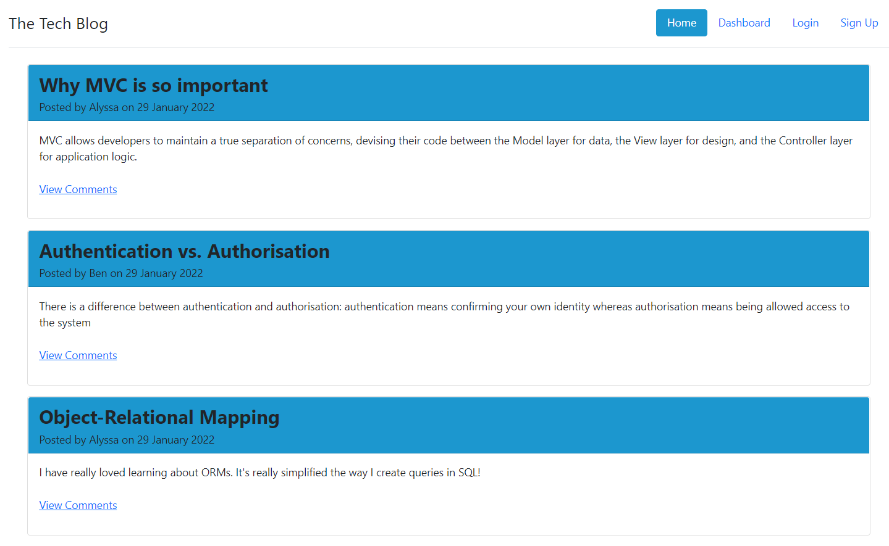
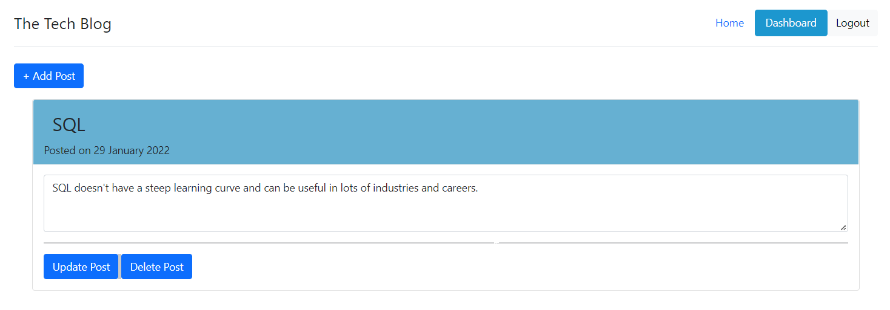
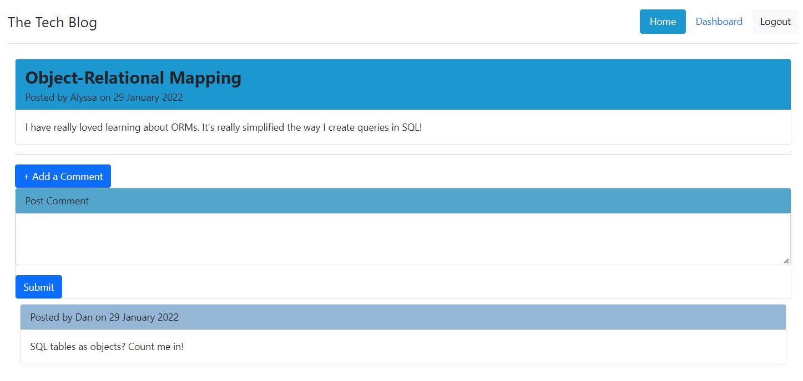
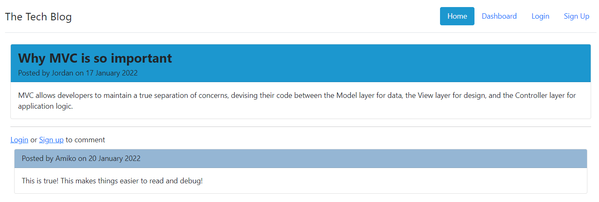

# Fullstack Tech Blog

## Description

This application is a CMS-style blogsite where developers can publish their blogposts and comment on other developers' posts as well. The application follows the Model-View-Controller (MVC) Paradigm in its architectural structure, uses Handlebars.js as the templating language, Sequelize as the Object-Relational Mapping (ORM) to MySQL, and the express-session npm package for authentication. This also utilizes Bootstrap as the frontend toolkit. The application is deployed in Heroku.

The application's main page is its homepage, where a user can view the existing blogposts, click on a specific blog, and see the comments for that post. The user can also create their own posts and comment on the other posts right after they have signed up or logged in. Logged in users can also update or delete any of their created posts in their dashboard page.

## Website

Visit [this](https://desolate-falls-44819.herokuapp.com/) to see the application in action.

## Demo

The following images shows the web application's appearance and functionality:

### Homepage

The homepage shows the existing blogposts and the navigation links at the top of the screen. The user can click on the 'View Comments' to view the specific posts and the comments for the post.



### Dashboard

The dashboard page can be loaded if the user is logged in. In this page, the user can create new blogposts or update or delete previous blogposts.



### Specific Posts

The comment button would be available once the user has logged in.



Otherwise, a link for signing up or logging in can be seen under the post.



## Installation

After forking the project, run the code below to install the modules needed to run this program:

```
npm install
```

Create a copy of the .env.EXAMPLE file, fill out the username and password of your MySQL database and save the file into .env

Run the following in MySQL to create the database and also seed the database with sample records.

```
mysql -u root -p
source ./db/schema.sql
```

Run the code below to seed the database:

```
npm run seed
```

## Usage

To run the program, run the code below:

```
npm start
```

Open a new tab and go to [http://localhost:3001](http://localhost:3001)
